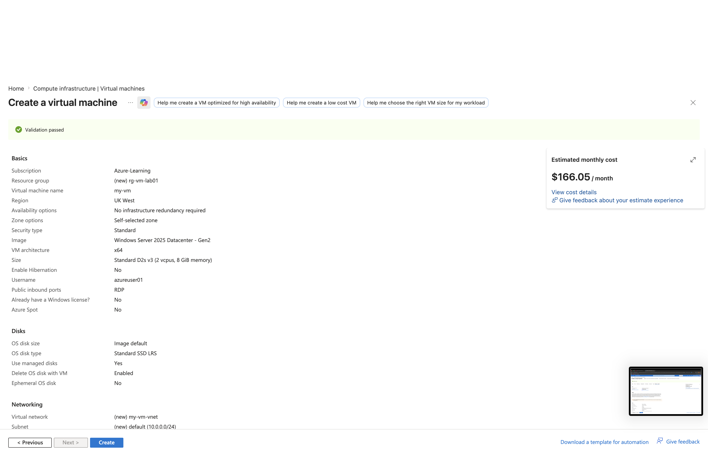
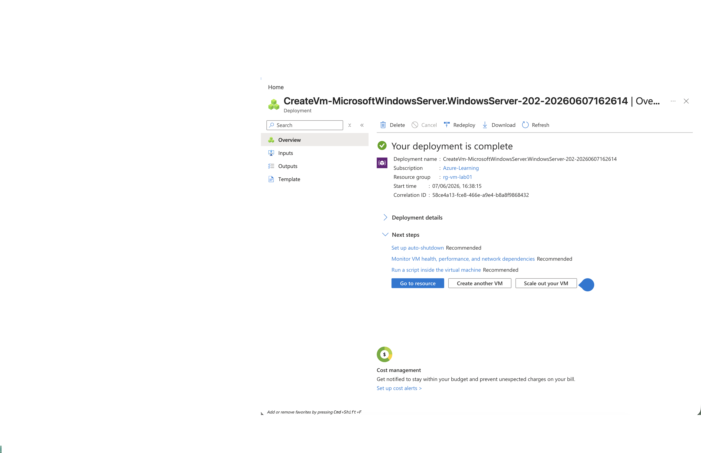
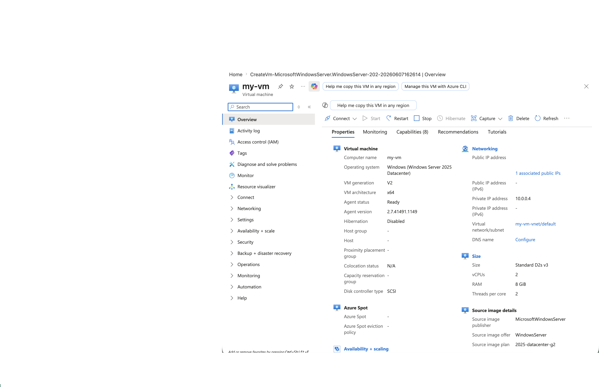

# Lab 1 - Cloud Concepts

## Objective

Understand the difference between Infrastructure as a Service (IaaS) and Platform as a Service (PaaS).

## Tasks

- [x] Create a Virtual Machine (IaaS)
- [x] Create a Web App (PaaS)

---

## Azure Virtual Machine (IaaS)

### Description

Azure Virtual Machines are an example of Infrastructure as a Service (IaaS). Microsoft manages the physical infrastructure while the customer manages the operating system, applications, and configuration.

### VM Configuration

### Deployment Complete

### VM Overview

---

## Azure Web App (PaaS)

### Description

Azure App Service is an example of Platform as a Service (PaaS). Microsoft manages the underlying infrastructure, operating system, and runtime while the customer focuses on deploying and managing the application.

### Screenshots

*(Add your Web App screenshots here after completing the lab.)*

---

## Key Learning

| Service | Cloud Model |
|----------|------------|
| Azure Virtual Machine | IaaS |
| Azure App Service | PaaS |

This lab demonstrated the difference between Infrastructure as a Service (IaaS) and Platform as a Service (PaaS) in Azure.
