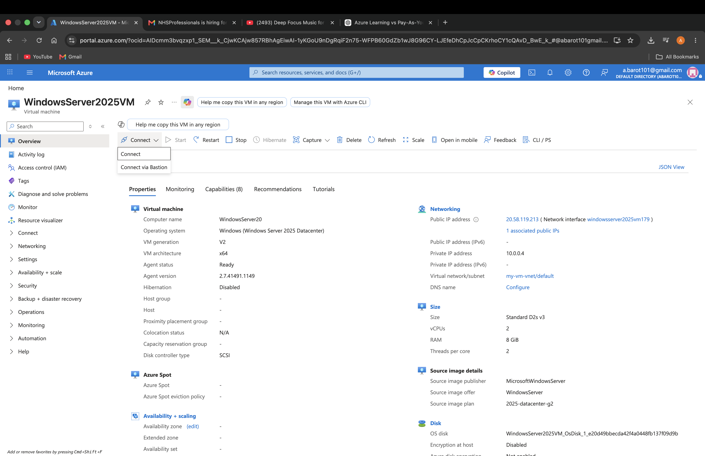
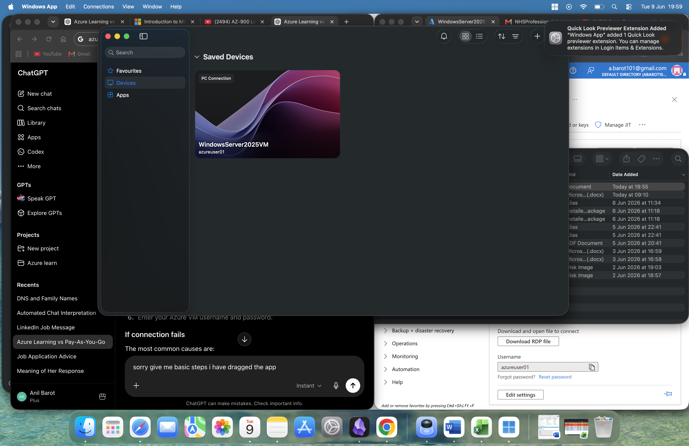
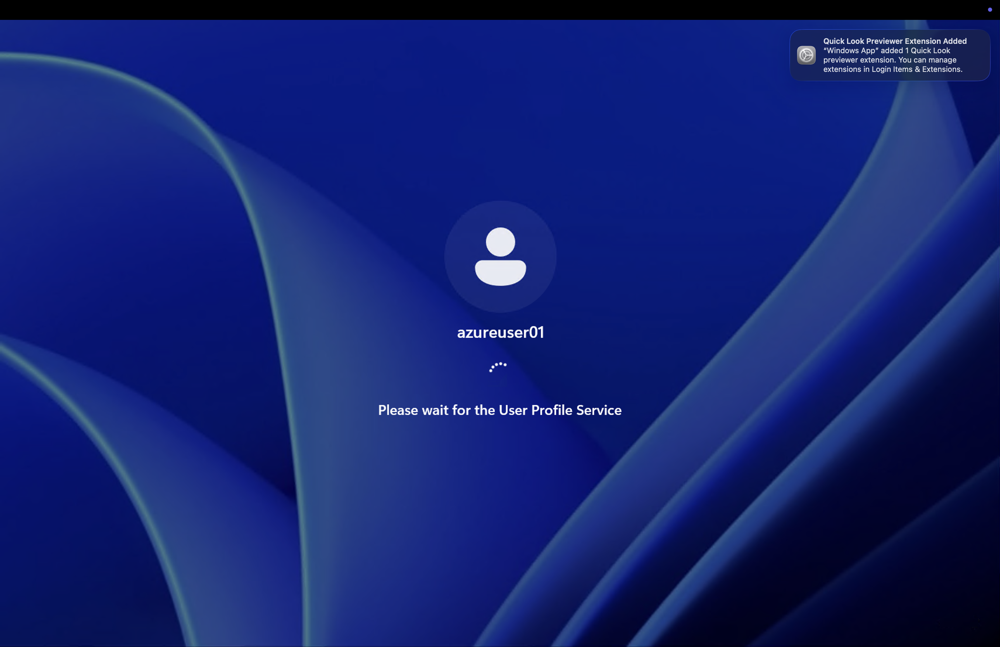
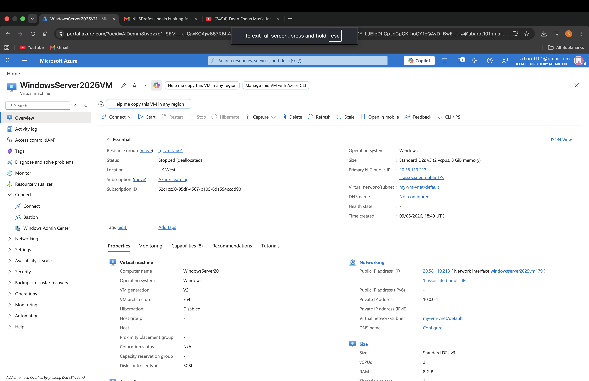

# Lab 2 - Azure Virtual Machines

## Objective

Deploy and connect to a Windows Server virtual machine in Microsoft Azure.

## Azure Services Used

- Azure Virtual Machines
- Virtual Network (VNet)
- Network Security Group (NSG)
- Public IP Address

## Lab Tasks

- [x] Create a Windows Server VM
- [x] Connect using Remote Desktop Protocol (RDP)
- [x] Stop and deallocate the VM

## Screenshots

### Azure VM Created

### RDP Connection Initiated

### Windows Server Login

### Windows Server Desktop

### VM Stopped (Deallocated)

## Key Takeaways

- Learned how to deploy a Windows Server virtual machine in Azure.
- Connected to the VM remotely using RDP from macOS.
- Observed how Azure automatically creates supporting resources such as a VNet, NSG, and Public IP.
- Learned the difference between a stopped VM and a stopped (deallocated) VM.
- Practised basic VM lifecycle management by starting and stopping the virtual machine.
- Gained hands-on experience with Infrastructure as a Service (IaaS) in Azure.
