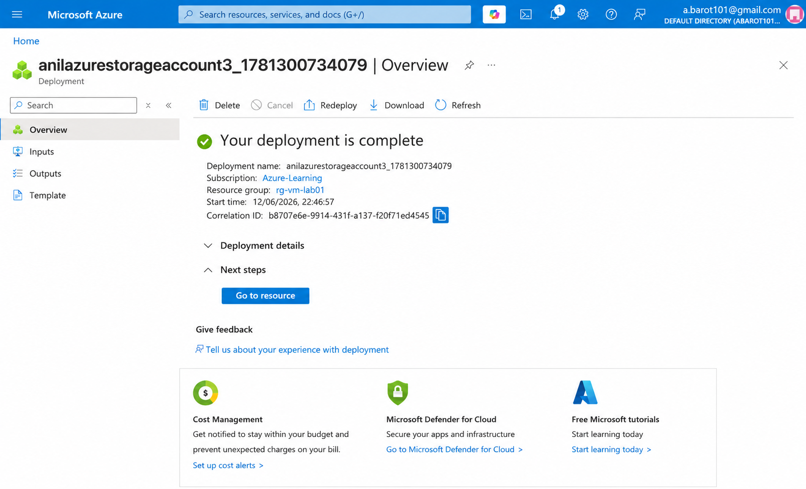
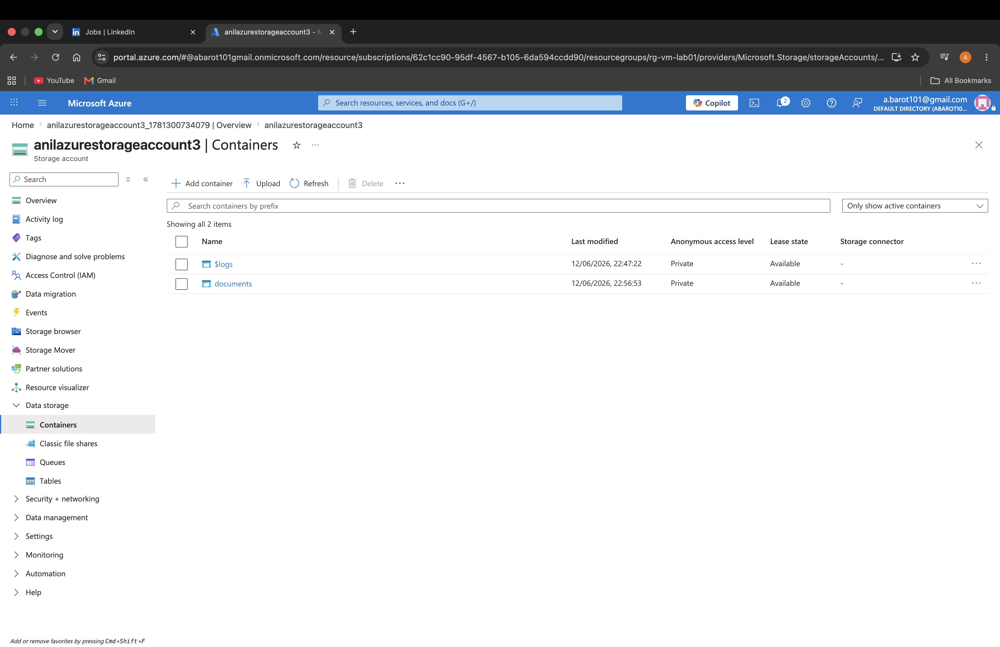
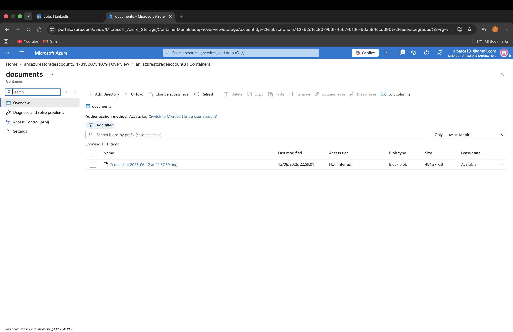
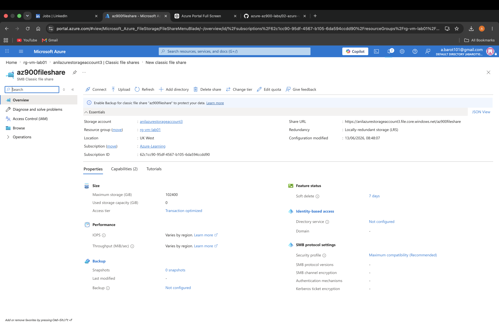
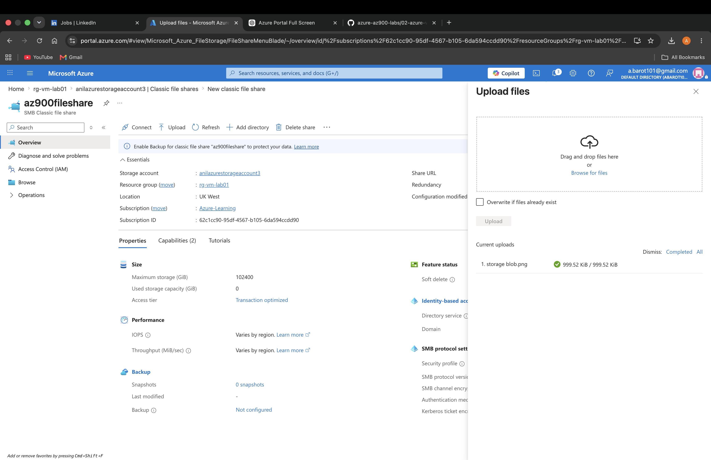

# Lab 3 - Azure Storage

## Objective

Gain hands-on experience with Azure Storage services and learn how to create and manage storage resources using the Azure Portal.

## Azure Services Used

- Azure Storage Account
- Azure Blob Storage
- Azure Files

## Lab Tasks

- [x] Create a Storage Account
- [x] Explore Storage Account settings
- [x] Create a Blob Container
- [x] Upload files to Blob Storage
- [x] Create an Azure File Share
- [x] Upload files to the File Share
- [x] Review access options

## Screenshots

### Storage Account Created

### Blob Container Created

### File Uploaded to Blob Storage

### Azure File Share Created

### File Uploaded to Azure File Share

## Key Takeaways

- Learned how Azure Storage Accounts act as the foundation for Azure storage services.
- Gained hands-on experience creating and managing Blob Storage containers and uploading files.
- Understood how Blob Storage stores unstructured data such as documents, images, videos, and backups.
- Learned how Azure Files provides cloud-based shared storage similar to a traditional network file share.
- Practised managing files using both Blob Storage and Azure File Shares.
- Explored storage account settings including redundancy options such as Locally Redundant Storage (LRS).
- Improved familiarity with navigating and managing Azure Storage resources through the Azure Portal.
- Developed a clear understanding of the differences between Azure Blob Storage and Azure Files, an important AZ-900 exam topic.
